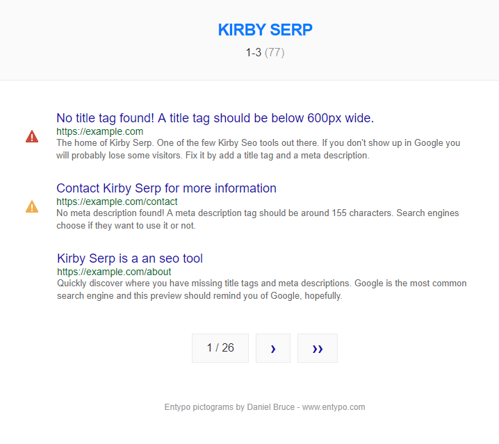

# Kirby Serp

  

***Note:*** *This is a commercial plugin. Read more about [how to purchase](#purchase).*

SEO tool to quickly find missing title tags and meta descriptions on your site.

## Table of contents

1. **Get started**
   1. [Install](docs/install.md)
   1. [Usage](docs/usage.md)
   1. [Options](docs/options.md)
1. **Advanced**
   - [Snippets](docs/snippets.md)
1. **Misc**
   - [Changelog](docs/changelog.md)

## Requirements

- PHP 7
- [**Kirby**](https://getkirby.com/) 2.5.5+

## Disclaimer

This plugin is provided "as is" with no guarantee. Use it at your own risk and always test it yourself before using it in a production environment. If you find any issues, please [create a new issue](https://github.com/username/kirby-serp/issues/new).

## Purchase

Be sure to try before you buy. Refunds are not supported. Read more in the [license agreement](docs/license.md).

***The purchase button is temporary disabled***

<!--

-->

## Credits

- [Jens Törnell](https://github.com/jenstornell)